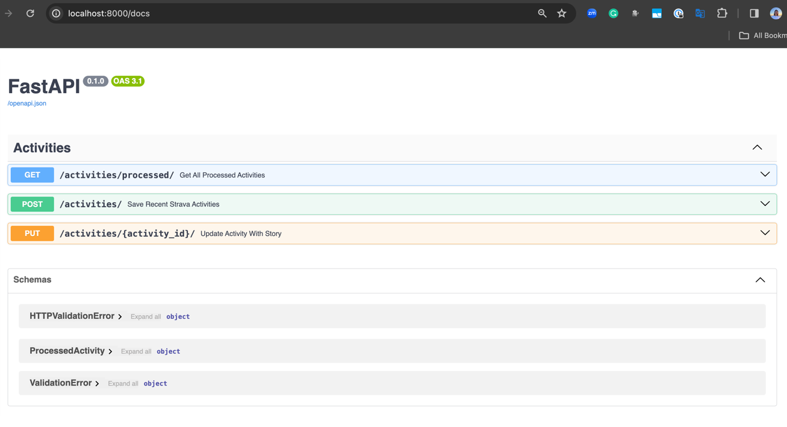
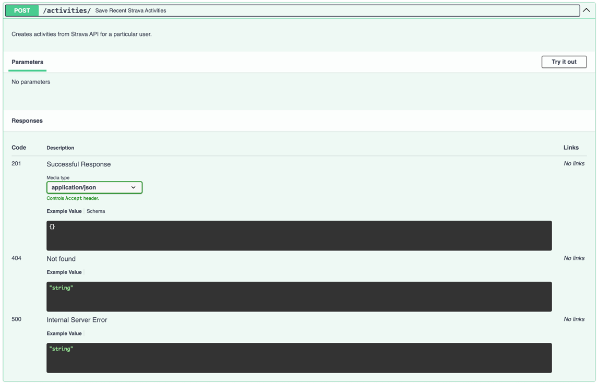
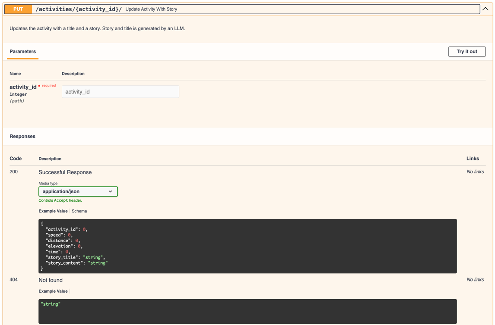
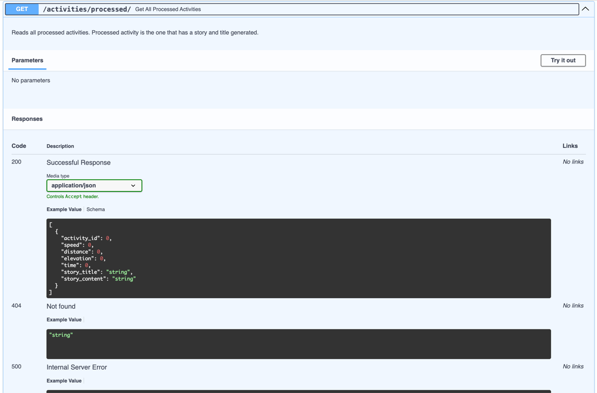

# LLM Story Generator

LLM based web service that generates brief stories using Strava activity data.

## Project Summary & Main Purpose

REST API (uses FastAPI under the hood) based web service designed to run on local machines that creates stories using
Strava data.

Users are authenticated through Strava. Web service allows users to get their last 3 activities. Available through
GET /activities/ endpoint.

An LLM model generates a story around 50 words for a given activity (might be a ride) based on the
speed (as max_speed), distance, time (as moving_time) and the elevation (as total_elevation_gain) of each activity.
Available through PUT /activities/ endpoint.

Moreover, users can list their processed activities. Available through GET /activities/processed/ endpoint.

The service has 3 endpoints in `activities` namespace:



**POST /activities/**: Creates activities from Strava. By default, it gets last 3 activities from Strava.


**PUT /activities/**: Takes activity_id as a parameter and returns the activity details, generated title and story. If
activity is not present in the database then gets the activity from Strava.


**GET /activities/processed/**: Lists all the activities the system has ever processed. A processed activity has a
story and title assigned.


## How to Install and Use

In a terminal

**Clone the repository and navigate to it**

```shell script
git clone git@github.com:cereniyim/llm-story-generator.git
cd <path-to-your-local-repository>
```

**Create local conda environment**

```shell script
conda create --name llm-story-generator python=3.9.18
```

**Activate environment**

```shell script
conda activate llm-story-generator
```

**Install requirements**

```shell script
pip install -r requirements.txt
```

**Pull Mongo Docker image**

```shell script
docker pull mongo:latest
```

**Create local MongoDB by spawning a container**

```shell script
docker run --name mongo -p 27017:27017 -d mongo:latest
```

**Start the service**

```shell script
uvicorn app.main:app 
```

You can access it and its documentation on Swagger http://0.0.0.0:8000/docs

## My approach on solving the challenge and key architectural decisions

While working on the challenge, I kept my focus on having a reasonably-working-well MVP web service covering all the
must-have requirements with a readable, high-quality, well-tested and well-documented code.

### Using pre-trained LLM model from Hugging Face

I experimented with several text generation NLP models, and after the experimentation I concluded that OpenChat model
yields
the most logical results. Also, it is a popular and well-maintained model. Model details can be
found [here](https://github.com/imoneoi/openchat)
and the paper is available [here](https://arxiv.org/pdf/2309.11235.pdf).

It is a generalist model that is fine-tuned on several open-source language models with mixed-quality data.

I usually prefer to use open source packages/models if they are coming from a trusted source, well-maintained, and they
have a widespread use.

Moreover, to be able to experiment with different models, I used Hugging Face Hub and to keep the local environment
lightweight.

Implementation can be found in `src/generators.py`.

### Using MongoDB as database solution

I used noSQL DB (MongoDB) as the database solution. It requires less schema pre-planning and design. Also, it allows
flexibility through documents. The flexible schema allowed me to do extensive integration testing.

In the context of a production application, mongoDB allows horizontal scaling through sharding. Assuming that there will
be terabytes of data for MarvinAI, Mongo DB could be a reasonable choice from that perspective as well.

Also, thinking from the production-scale chatbot application has motivated me to select MongoDB as the database
solution.

Implementation can be found in `src/gateway.py`.

### Strava authentication logic

One of the requirements was to authenticate users through Strava. I embedded authentication logic in the web service to
be able to share the state of the authentication among different endpoints.

I implemented a `StravaClient` which is a wrapper around [Strava API](https://developers.strava.com/docs/). It
implements authentication (only required for the first use), access token refresh and activity querying functionalities.

I kept necessary environment variables and secrets in a local `.env` file and loaded them during runtime.

Moreover, the service refreshes the token whenever expires with the wrapping of errors and `refresh_token` method
implementation.

Implementation can be found in `src/strava_client.py`.

### Image generation as bonus points

Please see `src/generators.py` `AIImageGeneration` class for the design and pseudocode implementation of image
generation feature.

By calling `generate` method with `story.__dict__` on the instance of `AIIMageGeneration` in PUT /activities/ endpoint,
this feature can be integrated into the service. E.g.

```python
@router.put("/{activity_id}/")
def update_activity_with_story(activity_id: int) -> ProcessedActivity:
    """
    Updates the activity with a title and a story. Story and title is generated by an LLM.
    """
    ...
    story_generator = AIStoryGenerator()
    story = story_generator.generate(activity)
    image_generator = AIIMageGenerator()
    story = image_generator.generate(story.__dict__)
    updated_activity = gateway.update(activity, story.__dict__)
    return ProcessedActivity(**updated_activity)
```

## Some Further System Improvements for a Production-Ready Service

### Extensive testing of LLM model

The core component of this web service is an LLM model. Whether it is developed in-house or a pre-trained model it
should be tested extensively. One example could be testing against edge cases like profanity, AI hallucinations and so
on.

Also, some guardrails should be implemented before going into the production E.g. MarvinAI should not answer any
questions that disclose employee salaries even though it is asked to provide.

All in all, the service should be well-tested from human-level judgement perspective.

### Containerization

Use Docker so that this service is deployable to any environment, for the production case that would be a cloud provider
like GCP or AWS.

### Store secrets securely in some secret manager

If this had been a production web service, the secrets that are required by classes and components must be stored
securely in a Secret Manager tool.

### Implement CI/CD pipelines

Implement CI/CD pipelines so that the testing (and deployment) process is automated. GitHub Actions can be a tool
for that.

For CI, whenever there is a new build, all unit tests are run. When implemented with high coverage of unit tests, it
automates the development cycle and decreases the potential of bugs.

## For Developers

### Project organization

    ├── README.md                         <- The top-level README explaining the project
    ├── src                               <- Core components
    │   ├── gateway.py                    <- MongoDBGateway impleementation
    │   ├── strava_client.py              <- StravaClient implementation
    │   ├── generators.py                 <- LLM based inference implementation
    ├── app                               <- fastAPI app 
    │   ├── routers                       <- namesapces
    │   │   ├── activities.py             <- GET, PUT, POST endpoint implementations
    │   ├── data_models.py                <- Output model class for the endpoints
    │   ├── main.py                       <- fastAPI app implementation
    ├── images                            <- Images used in the README
    ├── tests                             <- Unit tests
    ├── .gitignore                        <- Ignored files by git
    ├── requirements.txt                  <- Required Python packages for the environment creation

### Setup local environment & run unit tests

Change directory to your local repository

```shell script
cd <path-to-your-local-repository>
```

Create conda environment

```shell script
conda create --name llm-story-generator python=3.9.18
```

Activate environment

```shell script
conda activate llm-story-generator
```

Install requirements

```shell script
pip install -r requirements.txt
```

Add repository path to PYTHONPATH

```shell script
export PYTHONPATH=<path-to-your-repo-root>
```

Run unit tests

```shell script
py.test tests